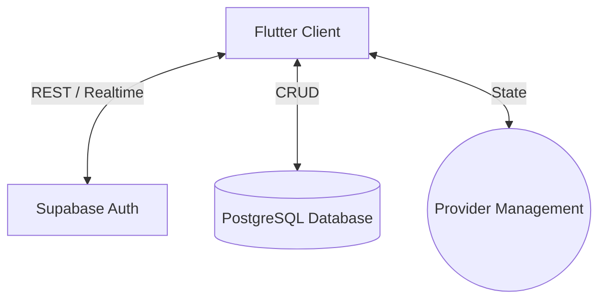

<div align="center">

# Barber 96
**Enterprise-Grade Barbershop Management & Booking System**


</div>

---

## 📌 Project Overview

Barber 96 adalah sistem reservasi dan manajemen operasional *barbershop* berskala *enterprise* yang dirancang untuk mengatasi inefisiensi pada model *walk-in* konvensional. 

Sistem ini memecahkan masalah nyata terkait antrean tidak terprediksi yang merugikan waktu pelanggan, kurangnya transparansi data finansial harian, serta ketiadaan metrik performa *kapster* (barber) secara riil. Dengan mengintegrasikan sistem antrean *live*, manajemen peran (Customer, Admin, Super Admin), dan analitik finansial, aplikasi ini berfungsi sebagai tulang punggung digital bagi operasional *barbershop* modern untuk memastikan skalabilitas, retensi pelanggan melalui sistem loyalitas, dan akurasi pencatatan data.

## ✨ Key Features

Aplikasi ini dibagi menjadi beberapa modul utama yang saling terintegrasi:

- **Live Queue Tracking:** Pelanggan dapat memantau estimasi waktu tunggu dan pergerakan antrean secara *real-time* dengan peringatan jika terjadi pembatalan atau perubahan.
- **Role-Based Access Control (RBAC):** Otentikasi aman yang memisahkan hak akses antara *Customer*, *Admin* (pengelola cabang), dan *Super Admin* (pemilik bisnis).
- **Financial & Activity Dashboard:** Analitik komprehensif metrik harian, mingguan, dan bulanan (Total Revenue, Total Bookings, Average Ticket) dengan kemampuan ekspor ke PDF.
- **Loyalty Program System:** Pencatatan otomatis poin pelanggan (Gold Member) berdasarkan aktivitas pemesanan untuk meningkatkan retensi.
- **Service & Staff Management:** Pengelolaan katalog layanan (Haircut, Shave, Treatment) beserta pengelolaan performa *barber*.

## 🛠 Tech Stack

Sistem ini dibangun dengan mempertimbangkan *maintainability* dan *performance*.

| Layer | Teknologi / Library | Deskripsi |
| :--- | :--- | :--- |
| **Frontend** | Flutter, Dart | *Cross-platform UI framework* untuk performa *native*. |
| **Backend & DB** | Supabase | PostgreSQL database, Auth, dan *Realtime subscriptions*. |
| **State Management**| Provider | Pendekatan reaktif untuk injeksi dependensi dan manajemen *state*. |
| **Routing** | GoRouter | Navigasi deklaratif berbasis URL yang mendukung *deep linking*. |
| **Environment** | flutter_dotenv | Pengelolaan rahasia (API Keys) yang terisolasi. |

## 🏗 System Architecture

Aplikasi ini mengadopsi **Feature-First Architecture** (struktur *folder* berdasarkan fitur) untuk memastikan modularitas kode tinggi dan mempermudah kolaborasi dalam tim.



## 🚀 Getting Started

Ikuti instruksi berikut untuk menjalankan proyek di lingkungan pengembangan lokal Anda.

### Prerequisites

- [Flutter SDK](https://docs.flutter.dev/get-started/install) (versi stabil terbaru disarankan)
- Kredensial Proyek [Supabase](https://supabase.com/)

### Installation

1. **Clone repositori**
   ```bash
   git clone https://github.com/username/barber-96.git
   cd barber-96
   ```

2. **Instalasi dependensi**
   ```bash
   flutter pub get
   ```

3. **Konfigurasi Environment**
   Buat file `.env` pada *root directory* dan isi konfigurasi Supabase Anda:
   ```env
   SUPABASE_URL=your_supabase_project_url
   SUPABASE_ANON_KEY=your_supabase_anon_key
   ```

## 💻 Usage

Gunakan perintah berikut untuk mengkompilasi dan menjalankan aplikasi:

```bash
# Menjalankan di perangkat/emulator yang aktif
flutter run

# Membangun APK untuk rilis Android
flutter build apk --release
```

## 📱 Screenshots

<div align="center">
  
| Customer Home | Booking Selection | Super Admin Dashboard | Live Queue Tracking |
| :---: | :---: | :---: | :---: |
|  |  |  |  |

*(Ganti `path/to/placeholder.jpg` dengan *path* gambar asli Anda)*

</div>

## 👥 Contributors

- **[Nama Anda]** - *Software Engineer* - [Profil GitHub/LinkedIn]
- *[Nama Anggota]* - *Role* - [Link]

---
*Dibuat dengan ❤️ untuk merevolusi manajemen barbershop.*
